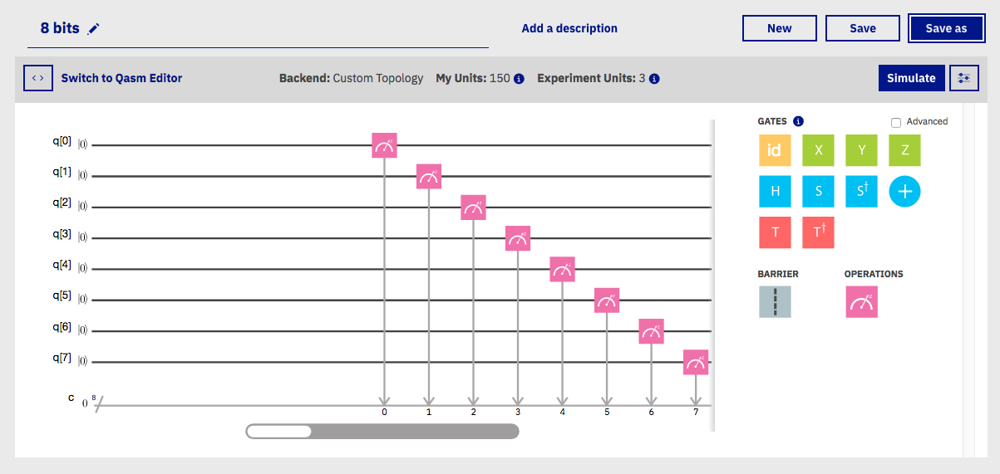
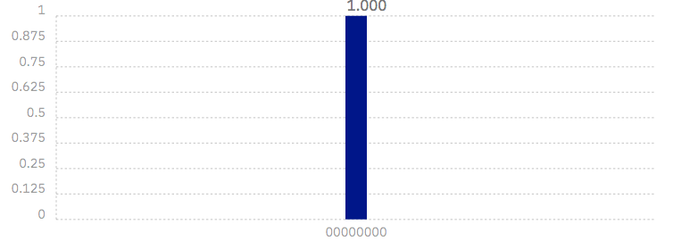
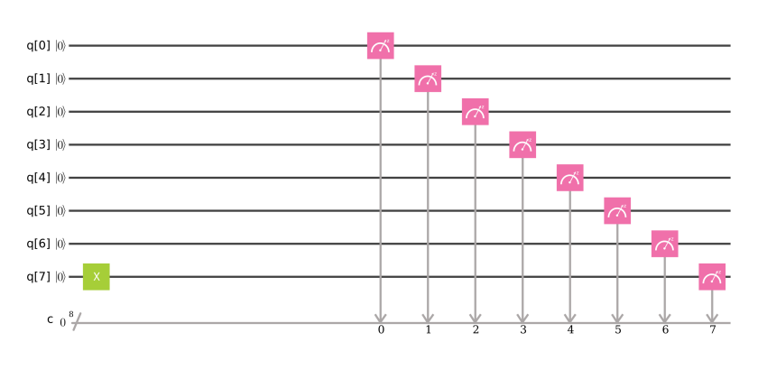
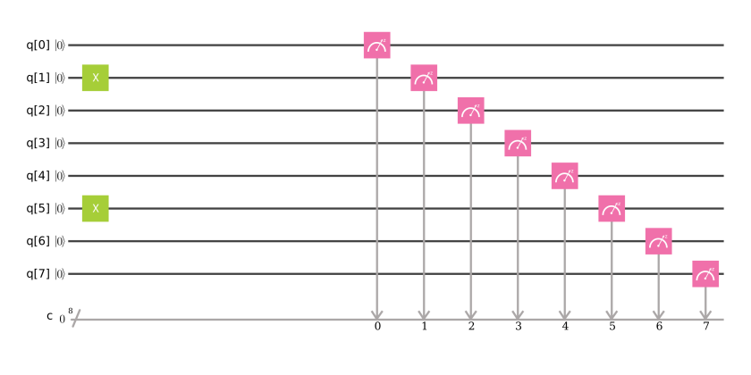
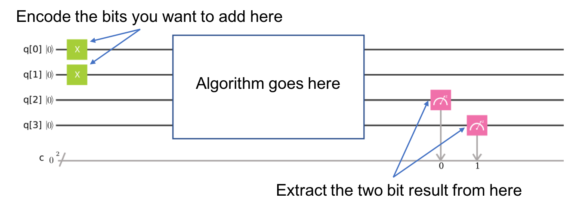
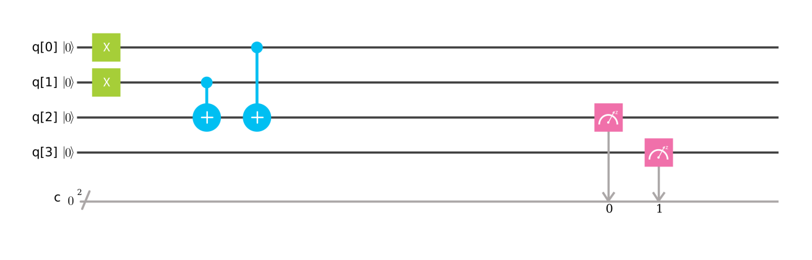
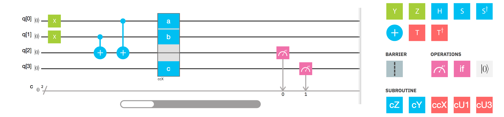
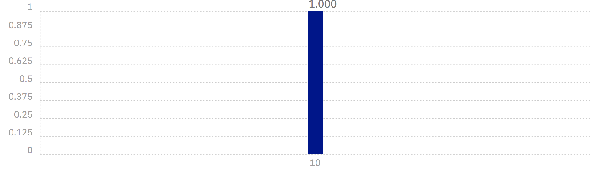

# The atoms of computation

Programming a quantum computer is now something that anyone can do in the comfort of their own home. The simplest way is to use the composer_._ This lets you construct programs with a graphical interface, and then run them on real devices in the IBM Research labs.

Once you've headed over to the website and set up your account, you’ll be given a blank canvas on which to create something quantum.


Screenshots might not reflect the most recent version of the composer.



But what to create? What is a quantum program anyway? In fact, what is a quantum computer?

These questions can be answered by making comparisons to standard digital computers. Unfortunately, most people don’t actually understand how digital computers work either. So in this article we’ll look at the basics principles behind these device. And to help us transition over to quantum computing later on, we’ll do it using the composer.

### **Splitting information into bits**

The first thing we need to know about is the idea of _bits_. These are designed to be the world’s simplest alphabet. With only two characters, 0 and 1, we can represent any piece of information.

One example is numbers. In European languages, numbers are usually represented using a string of the the ten digits 0, 1, 2, 3, 4, 5, 6, 7, 8 and 9. In this string of digits, each represents how many times the number contains a certain powers of ten. For example, when we write 9213, we mean

$$
9000 + 200 + 10 + 3
$$

or, expressed in a way that emphasizes the powers of ten

$$
9×10^3 + 2×10^2 + 1×10^1 + 3×10^0
$$

Though we usually use this system based on the number 10, we can just as easily use one based on any other number. The binary number system, for example, is based on the number two. This means using the two characters 0 and 1 to express numbers as multiples of powers of two. For example, 9213 becomes 10001111111101, since

$$
9213 = 1×8192 + 0×4096 + 0×2048+ 0×1024 +1×512 + 1×256\\~~~~~~~~~~~~~~ + 1×128 + 1×64 + 1×32 + 1×16 + 1×8 + 1×4 + 0×2 + 1×1
$$

Here these numbers are all powers of 2 \( $$8=2^3$$, $$4096=2^{12}$$ etc\).

A string of bits is called a _binary string._ From now on, we’ll write them in a special font to avoid confusion.

                                                             9213 = `10001111111101`

Binary strings can be used them to represent more than just numbers. For example, there is a way to represent any text using bits. For any letter, number or punctuation mark you want to use, you can find a corresponding string of at most eight bits using [this table](https://www.ibm.com/support/knowledgecenter/en/ssw_aix_72/com.ibm.aix.networkcomm/conversion_table.htm). This choice is quite arbitrary, but it is a widely agreed upon standard, and was used to transmit this article to you through the internet.

This is how all information is represented in computers. Whether numbers, letters, images or sound, it all exists in the form of binary strings.

Now let’s write a binary string using the composer. We’ll use the qubits of the composer as if they were just normal bits, and not do anything quantum with them.



The picture above shows what is known \(for historical reasons\) as a _circuit_. It depicts the story of what happens to the qubits during the program, from left to right. In this particular example, not much is happening. We set up eight qubits and number them from 0 to 7 \(because that’s how programmers like to do things\).

After setting up the 8 qubits, we immediately measure them. This is simply the process of seeing which bit value they represent. Qubits are always initialized to give the answer `0` if you immediately measure them. So if we press ‘simulate’, we should get the bit string `00000000`: a `0` from each qubit.



Programs made on the composer give us a histogram. This is because sometimes quantum computers have some randomness in their results. But since we aren’t doing anything quantum, we get one result with certainty: exactly the `00000000` that we expected.

To encode a different string, we need what is known as a _NOT gate_. This is the most basic operation that you can do in a computer. It simply flips the bit value: `0` becomes `1` and `1` becomes `0`. On the composer, we do this by dragging over the green box marked _X_. Let’s do it on qubit 7.



Now our computer outputs the string `10000000` instead.


The bit we flipped, which comes from qubit 7, lives on the far left of the string. This is because the composer numbers the bits in a string from left to right. If this convention seems odd to you, don’t worry. It seems odd to lots of other people too, and some prefer to number their bits the other way around. But this system certainly has its advantages when we are using the bits to represent numbers. This is because means that qubit 7 is telling us about how many $$2^7$$s we have in our number. So by flipping this bit, we’ve now written the number 128 in our simple 8-bit computer.

Now try out writing another number for yourself. You could do your age, for example. Just use Google to find out what the number looks like in binary \(if it includes a ‘0b’, just ignore it\), and then add some `0`s to the left side if you are younger than 64.



Now we know how to encode information in a computer. The next step is to process it. To take an input that we have encoded, and turn it into an output that we need.

### **Remembering how to add**

To look at turning inputs into outputs, we need a problem to solve. Let’s do some basic maths. In primary school you will have learned how to take large mathematical problems and break them down into manageable pieces. For example, how would you go about solving the following?

```text
   9213
+  1854

=  ????
```

One way is to do it digit by digit, from right to left. So we start with 3+4

```text
   9213
+  1854

=  ???7
```

And then 1+5

```text
   9213
+  1854

=  ??67
```

Then we have 2+8=10. Since this is a two digit answer, we need to carry the one over to the next column.

```text
   9213
+  1854
   ¹
=  ?067
```

Finally we have 9+1+1, and get our answer

```text
   9213
+  1854
   ¹
= 11067
```

This may just be simple addition, but it demonstrates the principles behind all algorithms. Whether the algorithm is designed to solve mathematical problems or process text or images, we always try to make things easy with small and simple steps.

To see what the smallest and simplest steps look like, let’s do the above addition problem again, but in binary.

```text
   10001111111101
+  00011100111110

=  ??????????????
```

Note that the second number has a bunch of extra 0s on the left. This just serves to make the two strings the same length.

Our first task is to do the `1+0` for the column on the right. In binary, as in any number system, the answer is `1`. We get the same result for the `0+1` of the second column.

```text
   10001111111101
+  00011100111110

=  ????????????11
```

Next we have `1+1`. As you’ll surely be aware, 1+1=2. In binary, the number 2 is written `10`, and so requires two bits. This means that we need to carry the `1`, just as we would for the number 10 in decimal.

```text
   10001111111101
+  00011100111110
             ¹
=  ???????????011
```

The next column now requires us to calculate `1+1+1.` This means adding three numbers together, so things are getting complicated for our computer. But we can still compile it down to simpler operations, and do it in a way that only ever requires us to add two bits together. For this we can start with just the first two `1`s.

```text
   1
+  1
= 10
```

Then we add the final `1` to the result using our usual method of going through the columns.

```text
  10
+ 01
= 11
```

The final answer is `11` \(also known as 3\).

Now we can get back to the bigger problem. With the answer of `11`, we have another carry bit.

```text
   10001111111101
+  00011100111110
            ¹¹
=  ??????????1011
```

So now we have another `1+1+1` to do. But we already know how to do that, so it’s not a big deal.

In fact, everything left so far is something we already know how to do. This is because, if you break everything down into adding just two bits, there’s only four possible things you’ll ever need to calculate. Here are the four basic sums \(we’ll write all the answers with two bits to be consistent\).

```text
0+0 = 00 (in decimal, this is 0+0=0)
0+1 = 01 (in decimal, this is 0+1=1)
1+0 = 01 (in decimal, this is 1+0=1)
1+1 = 10 (in decimal, this is 1+1=2)
```

This is called a _half adder_. If our computer can implement this, and if it can chain many of them together, it can add anything. Let’s make one with the composer.

### Adding with the composer



The two bits we want to add are encoded in the qubits 0 and 1. The above example encodes a `1` in both these qubits, and so it seeks to find the solution of `1+1`. The result will be a string of two bits, which we will read out from the qubits 2 and 3. All that remains is to fill in the actual program, which lives in the blank space in the middle.

The basic operations of computing are known as _gates_. We’ve already used the NOT gate, but this is not enough to make our half adder. We could only use it to manually write out the answers. But since we want the computer to do the actually computing for us, we’ll need some more powerful gates.

To see what we need, let’s take another look at what our half adder needs to do.

```text
0+0 = 00
0+1 = 01
1+0 = 01
1+1 = 10
```

The rightmost bit in all four of these answers is completely determined by whether the two bits we are adding are the same or different. So for `0+0` and `1+1`, where the two bits are equal, the rightmost bit of the answer comes out `0`. For `0+1` and `1+0`, where we are adding different bit values, the rightmost bit is `1`.

To get this bit of our solution correct, we need something that can figure out whether two bits are different or not. Traditonally, in the study of normal digital computation, this is called an _OR gate_.

In quantum computers, and so also on the composer, the job of the OR gate is done by the _controlled-NOT_ gate. Since that's quite a long name, we usually just call it the _CNOT_.


This is applied to a pair of qubits. One acts as the _control qubit_ \(this is the one with the little dot\). The other acts as the _target qubit_ \(with the big circle\).

There are multiple ways to explain the effect of the CNOT. One is to say that it looks at its two input bits to see whether they are the same or different. Then it writes over the target qubit with the answer. The target becomes `0` if they are the same, and `1` if they are different.

Another way of explaining the CNOT is to say that it does a NOT on the target if the control is `1`, and does nothing otherwise. This explanation is just as valid as the previous one \(in fact, it’s the one that gives the gate its name\).

Try the CNOT out for yourself by trying each of the possible inputs. For example, here’s a circuit that tests the CNOT with the input `01`.


If you set this up, you’ll find that the output is `11`. We can think of this happening because of either of the following reasons.

* The CNOT calculates whether the input values are different and finds that they are, which means that it wants to ouput `1`. It does this by writing over the state of qubit 1 \(which, remember, is on the left of the bit string\), turning `01` into `11`.
* The CNOT sees that qubit 0 is in state `1`, and so applies a NOT to qubit 1. This flips the `0` of qubit 1 into a `1`, and so turns `01` into `11`.

For our half adder, we don’t want to overwrite our input. Instead, we want to write the result on a different pair of qubits. For this we can use two CNOTs.



We are now halfway to a fully working half adder. We just have the other bit of the output left to do: the one that will live on qubit 4.

If you look again at the four possible sums, you’ll notice that there is only one case for which this `1` instead of`0`: `1+1`=`10`. It happens only when both the bits we are adding are `1`.

To calculate this part of the output, we could just get our computer to look at whether both of the inputs are `1`. If they are — and only of they are — we need to do a NOT gate on qubit 4. That will flip it to the required value of `1` for this case only, giving us the output we need.

For this we need a new gate: like a CNOT, but controlled on two qubits instead of just one. This will perform a NOT on the target qubit only when _both_ controls are in state `1`. This new gate is called the _Toffoli_. For those of you who are familiar with Boolean logic gates, it is basically an AND gate.

To use the Toffoli in the composer, you’ll need to used the ‘Advanced’ checkbox. This gives you a few new gates, one of which is called ‘ccX’. This is another name for the Toffoli, since it can also be thought as a controlled-controlled-NOT. When you drag it onto your circuit, you’ll get three boxes marked ‘a’, ‘b’ and ‘c’. The ‘a’ and ‘b’ boxes are the controls, so we drag them to our input qubits. The ‘c’ box is the target, so we drag it to qubit 4. Then we have our half adder.



In this example we are calculating `1+1`, because the two input bits are both `1`. Let’s see what the result is.



We get `10`, which is the binary representation of the number 2. We have built a computer that can solve the famous mathematical problem of 1+1!

All that’s left is to try it out with the other three possible inputs, and show that our algorithm gives the right results for those too. Perhaps the easiest way to try this is to use the ‘Qasm Editor’ rather than the graphical interface of the composer. Just paste in the following.

```text
include "qelib1.inc";
qreg q[4];
creg c[2];

// We want to calculate a + b, for two bits a and b

// For a=0, remove the following line. For a=1, leave it.
x q[0];

// For b=0, remove the following line. For b=1, leave it.
x q[1];

cx q[1],q[2];
cx q[0],q[2];
ccx q[0],q[1],q[3];

measure q[2] -> c[0];
measure q[3] -> c[1];
```

The half adder contains everything you need for addition. With the NOT, CNOT and Toffoli gates, we can create programs that add any set of numbers of any size. You could try making some [more complex adders](https://en.wikipedia.org/wiki/Adder_%28electronics%29) yourself, or check out [some examples](https://github.com/Qiskit/openqasm/blob/master/examples/README.md) in Qasm form.

These three gates are also enough to do everything else in computing too. In fact, we can do even do without the CNOT, and the NOT gate is only really needed to create bits with value `1`. The Toffoli gate is essentially the atom of mathematics. It is simplest element into which every other problem solving technique can be compiled.

In quantum computing, we split the atom.

