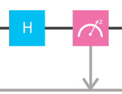
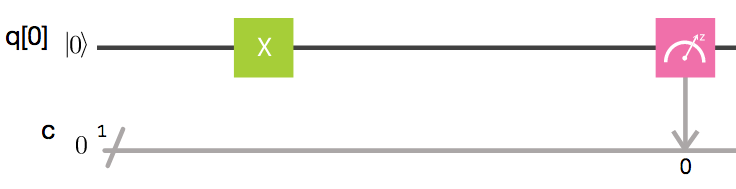
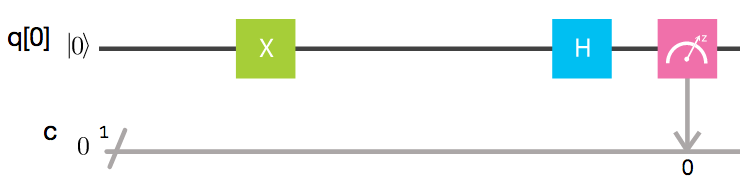
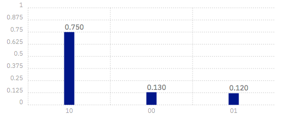
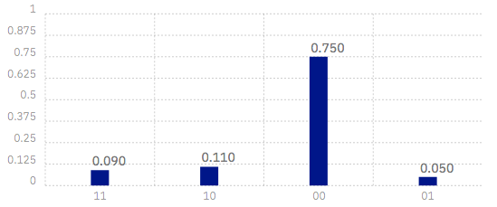

# The unique properties of qubits

You now know something about bits, and about how our familiar digital computers work.

Now it’s time to go beyond bits, and use the composer for what it was really designed for. It’s time to look at _qubits_.

In modern computers, there are all kinds of variables, objects and structures that we can use in our software. But in the end, they are all just big piles of bits. Those of us who work on quantum computing call these _classical variables_. The computers that use them, like the one you are using to read this article, we call _classical computers._

Qubits are a quantum variant of the bit. They are quantum objects, obeying the laws of quantum mechanics. Can we think of these as being equivalent to a big pile of bits too?

This is essentially the question tackled by Einstein, Podolsky and Rosen back in 1935. No one spoke of qubits back then, and people hardly spoke of computers. But if we translate their arguments into modern language, they essentially claimed that qubits can indeed be described by some form of classical variable. They didn’t know how to do it, but they were sure it could be done. Then they thought that quantum mechanics could be replaced by a much nicer and more sensible theory.

But they were wrong. In 1964, J. S. Bell showed that quantum variables behaved in a way that was fundamentally unique. In terms of quantum computing, this means that qubits are a kind of variable that is fundamentally different to anything in classical computers. There is no way to replace each qubit in a classical computation with a classical equivalent.

We can prove this quite easily using the composer, by making a variant of [Hardy’s paradox](https://en.wikipedia.org/wiki/Hardy%27s_paradox). But first, let’s get to know qubits a little better.

As we saw in the last article, we can make a qubit give us a bit, in a process known as measurement.


You may notice the small ‘z’ written in the box that represents this operation. This is because it represents only one of an infinite number of possible ways to measure a qubit. Specifically, it is a _z measurement_.

To do other kinds of measurements with the composer, we need to use more boxes. The simplest option is the _x measurement_, which simply looks like this.



One of the most important aspects of qubits is how these two kinds of measurements relate to each other. To get a sense of this, you could play around with single qubit circuits on the composer. Try out any combination of gates you like, and see what the result is for both z and x measurements.

For example, I’ll do something very simple: just a single X gate. Now let’s see what happens when we try a z measurement.



The result: the qubit knows with certainty that it must output a `1`.


Now let’s repeat the exact same setup, but we’ll observe the qubit using an x measurement instead.



This time, the outcome is random. In the results below, the process is repeated almost 10,000 times, and the result was no more certain than a coin toss. Around 50% came out `0` and 50% came out `1`.


This is due to Heisenberg’s uncertainty principle. A qubit has a limited amount of information that it can be certain about. If it is certain what output to give for a z measurement, it is completely uncertain about an x measurement.

If you try with an H gate instead of an X, you’ll make a qubit that is completely certain about what outcome to give for an x measurement instead. But this will come at a cost: the result for a z measurement becomes completely uncertain.

By trying other gates, you might find more complex cases. For example, there are cases where the qubit is mostly, but not completely, certain about what answer to give for both kinds of measurement. This is also allowed: though the qubit has a limited amount of certainty, this can be shared between both kinds of output.

The uncertainty we see here is essentially what Einstein, Podolsky and Rosen objected too. They thought it meant that quantum mechanics was incomplete. They thought that a qubit always knew what answer it would give to both kinds of measurement. It only seemed random, because of information hidden in the qubits that we could not see. As Einstein said: God does not play dice with the universe.

More recently, some people learning about quantum computing don’t seem to like this uncertainty either. They see it as a bug, when really it is one of the defining features. We need both the certainty and the uncertainty of a qubit. The certainty it is where we can encode the inputs of our computations. But it is the uncertainty that allows qubits to break free of the constraints of classical variables.

Before we get carried away, let’s look at some cold, hard data. To prove the unique nature of qubits, we’ll need two of them.


Here a few gates have been applied to two qubits. This includes the U3 gate that you’ll find under the advanced options. We won’t explain what each individual gate does for the moment. Instead, we’ll think about the two qubit state that they have set up.


To find out something about the state, we need to measure it. First, let’s do a z measurement of each qubit.


If you want to follow along yourself, you can set up the above circuit using the graphical editor. Or you can simply copy the following into the qasm editor.

```text
include "qelib1.inc";
qreg q[2];
creg c[2];

u3(1.911,0,0) q[1];
cx q[1],q[0];
u3(0.785,0,0) q[0];
cx q[1],q[0];
u3(2.356,0,0) q[0];

measure q[0] -> c[0];

measure q[1] -> c[1];
```

Here are some results. The process is a bit random, so the numbers you get out might be different, but everything should be largely the same.


An important thing to note is that the results are not independently random. If they were, there would be some probability that both qubits output `0`. Since that never happens, we know that these qubits must have been set up in some correlated way.

To make what follows a bit less wordy, let’s introduce a bit of terminology. When we get an output from a qubit using a z measurement, let’s call it the z output. The discovery we made in the results above can then be stated as follows.

**Fact 1: The z outputs of the qubits will never both be** **`0`.**

Now let’s look at the qubits in a different way. We’ll look at the x output of qubit 0 and the z output of qubit 1.




It’s the `11` result that’s impossible in this case. Then same is true when we look at the z output of qubit 0 and the x output of qubit 1. These discoveries can be summarized as follows

**Fact 2: The x output of one qubit and the z output of the other will never both be** **`1`.**

Now we’ve tried all combinations of measurements except one: it’s time to look at the x output of both qubits.


But we get the results for this, let’s try to guess what we’ll find. From what we know so far, we can prove that it will be impossible for both x outputs to be `1`.

We can prove this, let’s think about what it would mean for both x outputs to be `1`. We know that an x output of `1` for one qubit must mean that the z output of the other is `0` \(because Fact 2 tells us that both these outputs being `1` is impossible\). So if the x output of both qubits is `1`, it means that the z outputs of both qubits must be `0`.

This leads us to a contradiction: from Fact 1 we know that the z outputs of the qubits cannot both be `0`. So to avoid this impossible thing, we find that it must also be impossible for both x outputs to be `1`.

From Facts 1 and 2, we have therefore deduced Fact 3.

**Fact 3: The x outputs of the qubits will never both be** **`1`.**

Now let’s look at the x outputs and see our fact in action.



It seems that Fact 3 is not as factual as it appears. Of all our results, 9% of them gave this ‘impossible’ result. It is not impossible at all.

So where did we go wrong? Our mistake was in the following piece of reasoning.

> if the x output of both qubits is `1`, the z outputs of both qubits must be `0`.

We used our knowledge of the x outputs to work out what the z ouputs were. Once we’d done that, we were certain about the value of both. More certain than the uncertainty principle allows us to be. And so we were wrong.

Our logic would be completely valid if we weren’t reasoning about quantum objects. If it was some non-quantum variable, that we initialized by some random process, the x and z outputs would indeed both be well defined. It would make perfect sense to use one to deduce the value of the other. And Fact 3 would be a perfectly valid fact. The restriction it predicts would apply, and it would be impossible for both x outputs to be `1`.

But our qubits behave differently. The uncertainty of quantum mechanics allows qubits to dodge restrictions placed on classsical variables. It allows them to do things that would otherwise be impossible.

This is what makes quantum computers able to outperform classical computers. It leads to effects that allow programs made with quantum variables to solve problems in ways than those with normal variables cannot.

But just because qubits don’t follow the same logic as normal computers, it doesn’t mean they defy logic entirely. They obey the definite rules laid out by quantum mechanics.

If you’d like to learn these rules, we’ll guide you through them and how to express them using math in the rest of this guide. You'll also be introduced to all the basic principles behind quantum algorithms.

If you’d rather build up some intuition instead, there are a few ways to play with quantum computers:

* Continue experimenting with qubits on the composer.
* Play the game [_Hello Quantum_](http://helloquantum.mybluemix.net/), which has puzzles based on how to manipulate the z and x outputs using basic gates.
* Play the sister game: [_Hello Qiskit_](http://ibm.biz/hello-qiskit). This will show you how to use [Qiskit](https://qiskit.org/), our framework for writing quantum programs using standard programming tools.

Whichever path you choose, have fun in the wonderful world of quantum.


