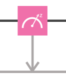

# Qubits as physical systems

To understand how a quantum program works, step-by-step, we need some way of writing down what is happening. We need to be able to write down the state of the qubits at any point in the computation. We need to write down the operations we perform on our qubits such that we can see the effects they'll have. In this section we introduce the notation used to write down qubit states using vectors.

### Qubits as vectors

Just as we typically think of a bit as being one of the two states `0` and `1`,  we also think of a qubit in terms of two complementary states. We write these $$|0\rangle$$ and $$|1\rangle$$. The $$|$$ and the $$\rangle$$ here essentially just remind us that we are talking about the qubit states labelled 0 and 1, rather than the bit states `0` and `1` or the numbers 0 and 1. It is part of the bra-ket notation, introduced by Dirac.

We represent qubit states by two dimensional vectors. For example, our two basis states $$|0\rangle$$ and $$|1\rangle$$ are usually written

$$
|0\rangle = \begin{pmatrix} 1 \\ 0 \end{pmatrix} ~~~~ |1\rangle =\begin{pmatrix} 0 \\ 1 \end{pmatrix}.
$$

Other possible qubit states can be written as a linear combination of these two basis states.

$$
|\psi\rangle=\alpha |0\rangle + \beta |1\rangle
$$

Here $$\alpha$$ and $$\beta$$ can be any complex numbers, with the constraint that $$|\alpha|^2+|\beta|^2=1$$. When we have a state like this, where both $$\alpha$$ and $$\beta$$ are non-zero, we call it a _superposition_ of $$|0\rangle$$ and $$|1\rangle$$.

### Measuring a qubit

To get an output from a qubit, we need perform a process known as measurement. There are many ways to do this, and all can be done on the composer. One can be done by dragging and dropping just a single box. 



This is known as a _standard measurement_ or a _z basis measurement_. In Qasm, it is done with the command `measure`.

This measurement has an very simple effect for the states $$|0\rangle$$ and $$|1\rangle$$. For $$|0\rangle$$ we'll always get the outcome `0`, and for$$|1\rangle$$we'll always get `1`.

Things get more interesting when we measure superposition states. Quantum measurement is described by the [Born rule](https://en.wikipedia.org/wiki/Born_rule). In particular, when a qubit in some state $$|\psi\rangle$$ is measured in the standard basis, the result `0` is obtained with probability $$|\alpha|^2$$, and the result `1` is obtained with the complementary probability $$|\beta|^2$$.

If we repeat the measurement, we don't see the same random behavior again. Instead, we'll always get the same outcome as for the first try. We say that the superposition has been _collapsed_ by the measurement. It randomly chose whether to become $$|0\rangle$$ or $$|1\rangle$$, and then becomes that state from that point on.

### Qubits as physical systems

What we have described here is the abstract notion of a qubit. The prototype quantum computer you interact with in the composer uses a physical type of qubit called a _superconducting transmon qubit_, which is made from superconducting materials such as niobium and aluminum, patterned on a silicon substrate. The two states $$|0\rangle$$ and $$|1\rangle$$represent two possible energy levels within this superconducting system. The $$|0\rangle$$ has the lowest energy, and so is something called the _ground state_ of the qubit.

Physically, for the superconducting qubit to behave as the abstract notion of the qubit, the device must be at drastically low temperatures. In the IBM Quantum Lab, we keep the temperature so cold \(15 milliKelvin in a dilution refrigerator\) that there is no ambient noise or heat to excite the superconducting qubit. Once our system has gotten cold enough, which takes several days, the superconducting qubit reaches equilibrium at the ground state $$|0\rangle$$.

In the future, quantum programmers will not notice what kind of physical systems and interactions their qubits and gates are built from. Current prototype devices, however, can sometimes experience spurious effects. Though we usually simply label this as 'noise', it does provide a glimpse at the physics behind the devices.

### Applying a gate

To see some evidence that $$|0\rangle$$ really is the ground state, try running the Qasm below. Here, as in all quantum circuits, the qubit is initially prepared in the ground state $$|0\rangle$$. We then immediately follow this by the standard measurement. From a simulation \(or some cached examples\) you should find that the output always comes out as `0`. For a run on a real device there will be some randomness due to  imperfect measurements and/or residual heating of the qubit, but it should still output `0` with very high probability. 

```cpp
OPENQASM 2.0;
include "qelib1.inc";

// Register declarations
qreg q[1];
creg c[1];

// Quantum Circuit
measure q -> c;
```

To see what happens for a qubit in state $$|1\rangle$$, we need to be able to change the state of the qubit. To do this, we require the concept of a _quantum gate_, which is what we call the most basic operations that we can apply to qubits. A single-qubit quantum gate can be represented as a $$2 \times 2$$ [unitary matrix](https://en.wikipedia.org/wiki/Unitary_matrix) \(since quantum gates must be reversible and preserve probability amplitudes, the matrices must be unitary\). The quantum state $$ |\psi'\rangle$$ after the action of the gate is found by multiplying the original quantum state by the gate $$|\psi'\rangle=U|\psi\rangle$$. Here $$U$$ represents the gate.


The simplest quantum gate is the bit-flip gate, which we denote by $$X$$. It takes $$|0\rangle\rightarrow X|0\rangle=|1\rangle$$ ; in other words, it flips the zero to a one, or vice versa. This is similar to a classical NOT gate and has a matrix representation of

$$
X =\begin{pmatrix} 0 & 1 \\ 1 & 0 \end{pmatrix}.
$$

In the Composer it is given by a green gate with a $$X$$ in the middle \(see the example Qasm file below\). Try running it.

```cpp
OPENQASM 2.0;
include "qelib1.inc";

// Register declarations
qreg q[1];
creg c[1];

// Quantum Circuit
x q[0];
measure q -> c;
```

If you use the simulator, you will find the result `1` with certainty. This shows that the $$X$$ gate succeeded in preparing the state $$|1\rangle$$. If you use the real device, you'll see that the result `1` comes with high probability.

The crucial thing to notice from your results is that a  $$|0\rangle$$ on the real device is more likely to output `0` than a $$|0\rangle$$ is to output `1`. The $$|1\rangle$$appears to experience less noise. This is precisely because $$|1\rangle$$ is the high state in our qubits. If noise gives it the chance, it will take the opportunity to 'fall down' to the lower energy  $$|0\rangle$$ state. So with these two simple experiments, you were able to probe the physics of our devices.

